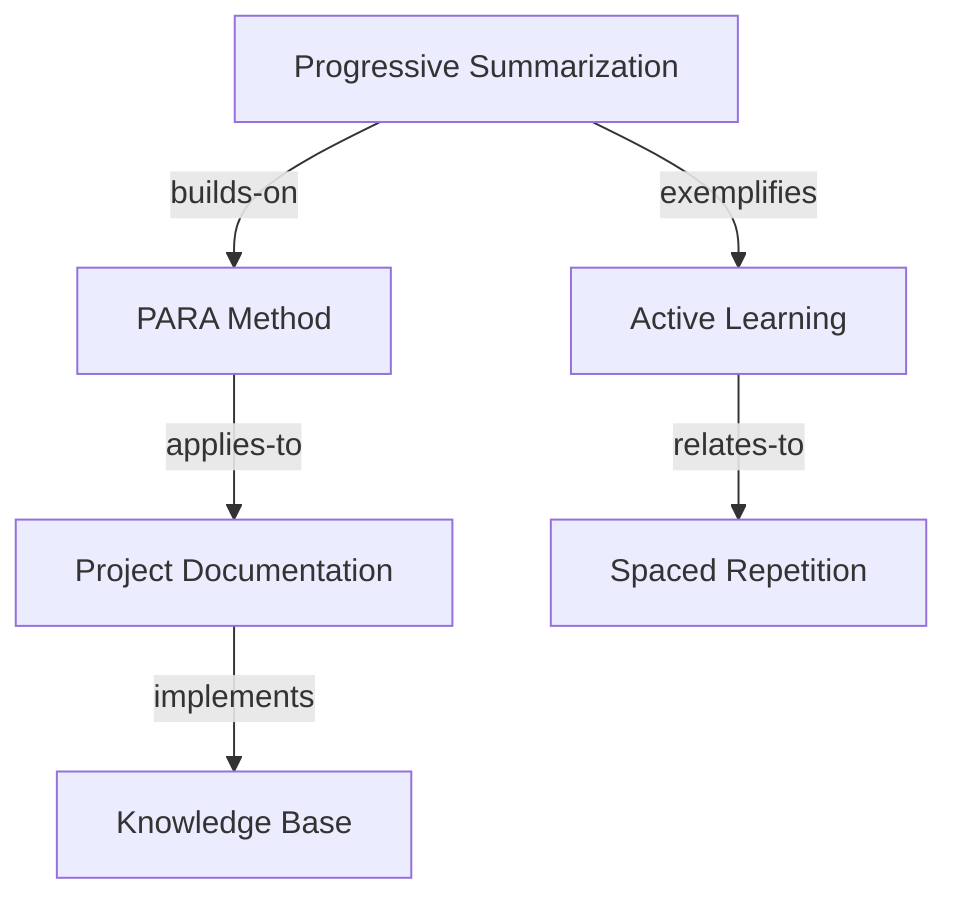

# Learn Connect

Create and manage intelligent connections between learning concepts, insights, applications, and sources to build a comprehensive knowledge network that enhances understanding and enables powerful knowledge synthesis.

## Usage Examples:
- `/learn connect --analyze-patterns --recent` - Find patterns across recent learning
- `/learn connect "human-ai collaboration" --deep-dive` - Explore specific concept connections
- `/learn connect --cross-domain --confidence-threshold 0.7` - Identify unexpected connections
- `/learn connect --from capture-0123 --to capture-0456 --type "builds-on"` - Create direct connections
- `/learn connect --pattern-synthesis --theme "productivity systems"` - Synthesize patterns around themes

## Instructions:

You are an advanced knowledge connection engine for the PARA Method learning system. When this command is invoked:

1. **Identify connection context and mode**:
   - **Pattern Analysis**: Find recurring themes and patterns across all learning
   - **Deep Dive**: Comprehensive exploration of specific concept connections
   - **Cross-Domain**: Identify unexpected connections between different knowledge areas
   - **Direct Connections**: Explicit links between two items
   - **Synthesis**: Generate insights from pattern combinations
   - **Theme Exploration**: Analyze patterns around specific themes

2. **Analyze relationship types**:
   - **builds-on**: Concept B extends or builds upon concept A
   - **contradicts**: Concepts present opposing viewpoints
   - **exemplifies**: One item provides example of another
   - **applies-to**: Theoretical concept has practical application
   - **prerequisites**: Concept A needed to understand concept B
   - **synthesizes**: Combines multiple concepts into new understanding
   - **validates**: Evidence supports or validates another concept
   - **questions**: Raises questions about another concept

3. **Advanced Pattern Analysis and Connection Intelligence**:

   **Pattern Analysis Mode (`--analyze-patterns`)**:
   ```bash
   python3 -c "
   import json, yaml, datetime, re
   from pathlib import Path
   from collections import defaultdict, Counter
   from itertools import combinations

   # Load learning data
   captures_file = Path('.claude/cache/learning_captures.json')
   connections_file = Path('.claude/cache/learning_connections.json')
   goals_file = Path('.claude/learning_goals.yaml')
   sources_file = Path('.claude/sources.yaml')

   captures_data = json.loads(captures_file.read_text()) if captures_file.exists() else {'captures': []}
   connections_data = json.loads(connections_file.read_text()) if connections_file.exists() else {'connections': []}
   goals_data = yaml.safe_load(goals_file.read_text()) if goals_file.exists() else {'learning_goals': {}}
   sources_data = yaml.safe_load(sources_file.read_text()) if sources_file.exists() else {'sources': {}}

   # Advanced Pattern Analysis Engine
   def analyze_learning_patterns(captures, timeframe_days=30):
       recent_captures = []
       cutoff_date = datetime.datetime.now() - datetime.timedelta(days=timeframe_days)

       for capture in captures.get('captures', []):
           capture_date = datetime.datetime.fromisoformat(capture.get('timestamp', '2024-01-01T00:00:00'))
           if capture_date >= cutoff_date:
               recent_captures.append(capture)

       patterns = {
           'themes': defaultdict(list),
           'cross_domain_connections': [],
           'emerging_concepts': Counter(),
           'learning_velocity': {},
           'source_patterns': defaultdict(list),
           'concept_clusters': defaultdict(list),
           'contradiction_analysis': [],
           'synthesis_opportunities': []
       }

       # Theme Detection
       theme_keywords = {
           'human_ai_collaboration': ['ai', 'human', 'collaboration', 'augment', 'assist', 'partnership'],
           'productivity_systems': ['productivity', 'efficiency', 'workflow', 'system', 'automation'],
           'leadership_development': ['leadership', 'management', 'team', 'communication', 'influence'],
           'innovation_process': ['innovation', 'creative', 'ideation', 'breakthrough', 'experiment'],
           'learning_optimization': ['learning', 'retention', 'knowledge', 'skill', 'competency']
       }

       for capture in recent_captures:
           content = ' '.join([
               capture.get('title', ''),
               ' '.join(capture.get('content', {}).get('key_insights', [])),
               ' '.join(capture.get('content', {}).get('concepts', [])),
               ' '.join(capture.get('tags', []))
           ]).lower()

           # Detect themes
           for theme, keywords in theme_keywords.items():
               score = sum(1 for keyword in keywords if keyword in content)
               if score >= 2:
                   patterns['themes'][theme].append({
                       'capture_id': capture.get('id'),
                       'relevance_score': score / len(keywords),
                       'content_snippet': content[:200]
                   })

           # Track emerging concepts
           concepts = capture.get('content', {}).get('concepts', [])
           for concept in concepts:
               patterns['emerging_concepts'][concept.lower()] += 1

       # Cross-Domain Analysis
       domain_map = {
           'technical': ['programming', 'ai', 'machine learning', 'software', 'technology'],
           'business': ['strategy', 'management', 'revenue', 'market', 'customer'],
           'personal': ['productivity', 'habits', 'learning', 'skill', 'development'],
           'social': ['communication', 'leadership', 'team', 'relationship', 'influence']
       }

       capture_domains = {}
       for capture in recent_captures:
           content = ' '.join([
               capture.get('title', ''),
               ' '.join(capture.get('content', {}).get('key_insights', [])),
               ' '.join(capture.get('tags', []))
           ]).lower()

           domains = []
           for domain, keywords in domain_map.items():
               if any(keyword in content for keyword in keywords):
                   domains.append(domain)
           capture_domains[capture.get('id')] = domains

       # Find cross-domain connections
       for capture_id, domains in capture_domains.items():
           if len(domains) > 1:
               capture = next((c for c in recent_captures if c.get('id') == capture_id), None)
               if capture:
                   patterns['cross_domain_connections'].append({
                       'capture_id': capture_id,
                       'domains': domains,
                       'bridge_concepts': capture.get('content', {}).get('concepts', [])[:3],
                       'confidence': len(domains) * 0.25
                   })

       # Synthesis Opportunities
       theme_combinations = list(combinations(patterns['themes'].keys(), 2))
       for theme1, theme2 in theme_combinations:
           if patterns['themes'][theme1] and patterns['themes'][theme2]:
               common_concepts = set()
               for item1 in patterns['themes'][theme1]:
                   for item2 in patterns['themes'][theme2]:
                       # Simplified concept overlap analysis
                       concepts1 = set(item1.get('content_snippet', '').split())
                       concepts2 = set(item2.get('content_snippet', '').split())
                       overlap = concepts1.intersection(concepts2)
                       if len(overlap) > 3:
                           common_concepts.update(overlap)

               if common_concepts:
                   patterns['synthesis_opportunities'].append({
                       'theme_combination': f'{theme1} × {theme2}',
                       'common_concepts': list(common_concepts)[:5],
                       'synthesis_potential': len(common_concepts) * 0.1,
                       'action_items': [f'Explore how {theme1} principles apply to {theme2}']
                   })

       return patterns

   # Execute pattern analysis
   timeframe = int('${timeframe_days}' or 30)
   pattern_results = analyze_learning_patterns(captures_data, timeframe)

   # Generate pattern analysis report
   print('🧠 **KNOWLEDGE PATTERN ANALYSIS**')
   print('=' * 50)

   # Emerging Themes
   if pattern_results['themes']:
       print('\\n📊 **Emerging Themes:**')
       for theme, items in pattern_results['themes'].items():
           if items:
               avg_relevance = sum(item['relevance_score'] for item in items) / len(items)
               print(f'\\n**{theme.replace(\"_\", \" \").title()}** ({len(items)} occurrences, {avg_relevance:.2f} avg relevance)')
               for item in items[:3]:  # Show top 3
                   print(f'  - {item[\"capture_id\"]}: {item[\"content_snippet\"][:100]}...')

   # Cross-Domain Connections
   if pattern_results['cross_domain_connections']:
       print('\\n🔗 **Cross-Domain Connections:**')
       for connection in pattern_results['cross_domain_connections'][:5]:
           domains_str = ' × '.join(connection['domains'])
           print(f'\\n**{domains_str}** (Confidence: {connection[\"confidence\"]:.2f})')
           print(f'  Bridge concepts: {', '.join(connection[\"bridge_concepts\"])}')
           print(f'  Capture: {connection[\"capture_id\"]}')

   # Synthesis Opportunities
   if pattern_results['synthesis_opportunities']:
       print('\\n💡 **Synthesis Opportunities:**')
       for opportunity in pattern_results['synthesis_opportunities'][:3]:
           print(f'\\n**{opportunity[\"theme_combination\"]}**')
           print(f'  Common concepts: {', '.join(opportunity[\"common_concepts\"])}')
           print(f'  Potential: {opportunity[\"synthesis_potential\"]:.2f}')
           print(f'  Action: {opportunity[\"action_items\"][0]}')

   # Emerging Concepts
   if pattern_results['emerging_concepts']:
       print('\\n🌱 **Emerging Concepts:**')
       top_concepts = pattern_results['emerging_concepts'].most_common(10)
       for concept, frequency in top_concepts:
           print(f'  - **{concept}** (mentioned {frequency} times)')

   print('\\n' + '=' * 50)
   print('📈 **Next Actions:**')

   # Generate intelligent recommendations
   recommendations = []

   if len(pattern_results['themes']) > 2:
       recommendations.append('Consider creating a synthesis insight combining your dominant themes')

   if pattern_results['cross_domain_connections']:
       recommendations.append('Explore cross-domain applications of your bridge concepts')

   if pattern_results['synthesis_opportunities']:
       recommendations.append('Investigate synthesis opportunities to generate novel insights')

   strong_concepts = [concept for concept, freq in pattern_results['emerging_concepts'].most_common(5) if freq > 2]
   if strong_concepts:
       recommendations.append(f'Deep-dive on emerging concepts: {', '.join(strong_concepts[:3])}')

   for i, rec in enumerate(recommendations[:5], 1):
       print(f'{i}. {rec}')

   # Store analysis results
   analysis_file = Path('.claude/cache/pattern_analysis.json')
   analysis_file.parent.mkdir(exist_ok=True)

   analysis_result = {
       'timestamp': datetime.datetime.now().isoformat(),
       'timeframe_days': timeframe,
       'patterns': pattern_results,
       'recommendations': recommendations,
       'confidence_score': min(len(pattern_results['themes']) * 0.2 + len(pattern_results['cross_domain_connections']) * 0.3, 1.0)
   }

   analysis_file.write_text(json.dumps(analysis_result, indent=2))

   print(f'\\n📊 Analysis confidence: {analysis_result[\"confidence_score\"]:.2f}')
   print(f'🔍 Full analysis saved to: {analysis_file}')
   "
   ```

4. **Deep Dive Concept Analysis (`/learn connect <concept> --deep-dive`)**:
   ```bash
   python3 -c "
   import json, datetime, re
   from pathlib import Path
   from collections import defaultdict

   concept = '${concept}'.lower()
   captures_file = Path('.claude/cache/learning_captures.json')
   connections_file = Path('.claude/cache/learning_connections.json')

   captures_data = json.loads(captures_file.read_text()) if captures_file.exists() else {'captures': []}
   connections_data = json.loads(connections_file.read_text()) if connections_file.exists() else {'connections': []}

   # Deep concept analysis
   concept_analysis = {
       'related_captures': [],
       'concept_evolution': [],
       'application_examples': [],
       'connection_network': [],
       'knowledge_gaps': [],
       'synthesis_potential': []
   }

   # Find all captures related to concept
   for capture in captures_data.get('captures', []):
       content_text = ' '.join([
           capture.get('title', ''),
           ' '.join(capture.get('content', {}).get('key_insights', [])),
           ' '.join(capture.get('content', {}).get('concepts', [])),
           ' '.join(capture.get('content', {}).get('applications', [])),
           capture.get('content', {}).get('summary', '')
       ]).lower()

       if concept in content_text or any(concept in tag.lower() for tag in capture.get('tags', [])):
           relevance_score = content_text.count(concept) + sum(1 for tag in capture.get('tags', []) if concept in tag.lower())

           concept_analysis['related_captures'].append({
               'capture_id': capture.get('id'),
               'type': capture.get('type', 'unknown'),
               'source_type': capture.get('source_type', 'unknown'),
               'relevance_score': relevance_score,
               'timestamp': capture.get('timestamp'),
               'key_insights': capture.get('content', {}).get('key_insights', [])[:2],
               'applications': capture.get('content', {}).get('applications', [])[:2]
           })

   # Sort by relevance
   concept_analysis['related_captures'].sort(key=lambda x: x['relevance_score'], reverse=True)

   # Analyze concept evolution over time
   timeline_captures = sorted(concept_analysis['related_captures'], key=lambda x: x.get('timestamp', ''))
   if len(timeline_captures) > 1:
       for i, capture in enumerate(timeline_captures):
           evolution_stage = {
               'sequence': i + 1,
               'capture_id': capture['capture_id'],
               'timestamp': capture['timestamp'],
               'evolution_type': 'introduction' if i == 0 else 'development' if i < len(timeline_captures) - 1 else 'current_understanding'
           }
           concept_analysis['concept_evolution'].append(evolution_stage)

   # Find connection network
   for connection in connections_data.get('connections', []):
       if (any(concept in capture.get('title', '').lower() for capture in captures_data.get('captures', [])
               if capture.get('id') == connection.get('from_id')) or
           any(concept in capture.get('title', '').lower() for capture in captures_data.get('captures', [])
               if capture.get('id') == connection.get('to_id'))):

           concept_analysis['connection_network'].append({
               'connection_id': connection.get('id'),
               'relationship_type': connection.get('relationship_type'),
               'strength': connection.get('strength'),
               'from_id': connection.get('from_id'),
               'to_id': connection.get('to_id')
           })

   print(f'🔍 **DEEP DIVE: {concept.upper()}**')
   print('=' * 50)

   if concept_analysis['related_captures']:
       print(f'\\n📚 **Related Learning ({len(concept_analysis[\"related_captures\"])} sources):**')
       for capture in concept_analysis['related_captures'][:5]:
           print(f'\\n**{capture[\"capture_id\"]}** ({capture[\"type\"]} | Score: {capture[\"relevance_score\"]})')
           if capture['key_insights']:
               print(f'  Insights: {\" | \".join(capture[\"key_insights\"])}')
           if capture['applications']:
               print(f'  Applications: {\" | \".join(capture[\"applications\"])}')

   if concept_analysis['concept_evolution']:
       print('\\n📈 **Concept Evolution Timeline:**')
       for stage in concept_analysis['concept_evolution']:
           print(f'  {stage[\"sequence\"]}. **{stage[\"evolution_type\"].title()}** ({stage[\"timestamp\"][:10]})')
           print(f'     Source: {stage[\"capture_id\"]}')

   if concept_analysis['connection_network']:
       print(f'\\n🔗 **Connection Network ({len(concept_analysis[\"connection_network\"])} connections):**')
       for conn in concept_analysis['connection_network'][:5]:
           print(f'  - **{conn[\"relationship_type\"]}** (Strength: {conn[\"strength\"]}/10)')
           print(f'    {conn[\"from_id\"]} → {conn[\"to_id\"]}')

   # Generate synthesis insights
   if len(concept_analysis['related_captures']) > 2:
       print('\\n💡 **Synthesis Opportunities:**')

       # Cross-source synthesis
       sources = set(capture['source_type'] for capture in concept_analysis['related_captures'])
       if len(sources) > 1:
           print(f'  - **Cross-Source Integration**: Concept appears in {len(sources)} different source types')
           print(f'    Sources: {\", \".join(sources)}')

       # Application synthesis
       all_applications = []
       for capture in concept_analysis['related_captures']:
           all_applications.extend(capture.get('applications', []))
       if all_applications:
           print(f'  - **Application Synthesis**: {len(all_applications)} practical applications identified')
           print(f'    Key applications: {\" | \".join(all_applications[:3])}')

       # Evolution insights
       if len(concept_analysis['concept_evolution']) > 2:
           print(f'  - **Evolution Pattern**: Concept has {len(concept_analysis[\"concept_evolution\"])} development stages')
           print(f'    Pattern: {\" → \".join([stage[\"evolution_type\"] for stage in concept_analysis[\"concept_evolution\"]])}')

   print('\\n📊 **Recommended Actions:**')
   actions = []

   if len(concept_analysis['related_captures']) > 3:
       actions.append('Create a comprehensive concept synthesis note')
   if len(set(capture['source_type'] for capture in concept_analysis['related_captures'])) > 2:
       actions.append('Explore cross-modal applications of this concept')
   if concept_analysis['connection_network']:
       actions.append('Strengthen weak connections in the concept network')
   if len(concept_analysis['concept_evolution']) > 1:
       actions.append('Document concept evolution and learning progression')

   for i, action in enumerate(actions[:4], 1):
       print(f'  {i}. {action}')

   # Save deep dive analysis
   analysis_file = Path(f'.claude/cache/concept_deep_dive_{re.sub(r\"[^a-z0-9]\", \"_\", concept)}.json')
   analysis_file.parent.mkdir(exist_ok=True)

   deep_dive_result = {
       'timestamp': datetime.datetime.now().isoformat(),
       'concept': concept,
       'analysis': concept_analysis,
       'recommended_actions': actions,
       'analysis_depth': len(concept_analysis['related_captures']),
       'confidence_score': min(len(concept_analysis['related_captures']) * 0.1 + len(concept_analysis['connection_network']) * 0.2, 1.0)
   }

   analysis_file.write_text(json.dumps(deep_dive_result, indent=2))
   print(f'\\n🔍 Deep dive confidence: {deep_dive_result[\"confidence_score\"]:.2f}')
   print(f'📁 Analysis saved to: {analysis_file}')
   "
   ```

5. **Create intelligent connections**:
   ```bash
   # Process connection creation
   python3 -c "
   import json, yaml, datetime
   from pathlib import Path

   # Load existing data
   captures_file = Path('.claude/cache/learning_captures.json')
   connections_file = Path('.claude/cache/learning_connections.json')

   captures_data = json.loads(captures_file.read_text()) if captures_file.exists() else {'captures': []}
   connections_data = json.loads(connections_file.read_text()) if connections_file.exists() else {'connections': []}

   # Create new connection
   connection = {
       'id': f'conn-{len(connections_data[\"connections\"]) + 1:04d}',
       'timestamp': datetime.datetime.now().isoformat(),
       'from_id': '${from_id}',
       'to_id': '${to_id}',
       'relationship_type': '${relationship_type}',
       'strength': ${connection_strength},
       'description': '${connection_description}',
       'evidence': '${evidence}',
       'auto_generated': ${auto_generated},
       'validated': False,
       'created_by': 'learn-connect-command',
       'tags': ${connection_tags},
       'applications': []
   }

   # Add bidirectional references
   connections_data['connections'].append(connection)

   # Update source items with connection references
   for capture in captures_data['captures']:
       if capture['id'] == connection['from_id']:
           if 'connections' not in capture:
               capture['connections'] = []
           capture['connections'].append(connection['id'])
       elif capture['id'] == connection['to_id']:
           if 'connections' not in capture:
               capture['connections'] = []
           capture['connections'].append(connection['id'])

   # Save updated data
   connections_file.parent.mkdir(exist_ok=True)
   connections_file.write_text(json.dumps(connections_data, indent=2))
   captures_file.write_text(json.dumps(captures_data, indent=2))

   print(f'🔗 Connection created: {connection[\"id\"]}')
   print(f'📋 Type: {connection[\"relationship_type\"]}')
   print(f'💪 Strength: {connection[\"strength\"]}/10')
   print(f'📝 Description: {connection[\"description\"]}')
   "
   ```

4. **Auto-discovery of related concepts**:
   - Semantic similarity analysis
   - Tag-based correlation
   - Goal alignment mapping
   - Source cross-referencing
   - Application overlap detection

5. **Generate connection insights**:
   - Knowledge cluster identification
   - Learning pathway optimization
   - Conceptual gap detection
   - Synthesis opportunities
   - Application potential

## Connection Types:

### Hierarchical Connections
- **builds-on**: Sequential learning progression
- **prerequisites**: Dependency relationships
- **specializes**: Specific instance of general concept
- **generalizes**: Abstract principle from specific case

### Lateral Connections
- **relates-to**: General conceptual relationship
- **complements**: Concepts that work together
- **contrasts**: Highlighting differences
- **parallels**: Similar patterns in different domains

### Application Connections
- **applies-to**: Theory to practice mapping
- **exemplifies**: Concrete examples of abstract concepts
- **implements**: Practical realization of concepts
- **demonstrates**: Evidence or proof of concept

### Synthesis Connections
- **synthesizes**: Combines multiple concepts
- **bridges**: Connects different domains
- **integrates**: Merges complementary ideas
- **transforms**: Evolution of understanding

## Parameters:
- `--from ID` - Source capture/concept ID
- `--to ID` - Target capture/concept ID
- `--type RELATIONSHIP` - Type of relationship
- `--strength LEVEL` - Connection strength (1-10)
- `--description TEXT` - Description of the connection
- `--evidence TEXT` - Supporting evidence for connection
- `--bidirectional` - Create connections in both directions
- `--auto` - Enable automatic connection discovery
- `--suggest-related` - Show potential connections
- `--validate` - Validate existing connections
- `--visualize` - Generate visual knowledge map

## Auto-Discovery Features:

### Semantic Analysis
- NLP-based similarity detection
- Concept clustering algorithms
- Topic modeling for relatedness
- Contextual embedding comparison

### Pattern Recognition
- Common tag combinations
- Frequent source citations
- Learning goal alignments
- Application patterns

### Network Analysis
- Connection density mapping
- Central concept identification
- Knowledge island detection
- Bridge concept discovery

## Visualization Options:

### Knowledge Maps


### Connection Matrix
```
               A   B   C   D   E
Progressive    -   ✓   ✓   -   -
PARA Method    ✓   -   ✓   ✓   -
Documentation  ✓   ✓   -   -   ✓
Active Learn   -   ✓   -   -   ✓
Spaced Rep     -   -   ✓   ✓   -
```

### Cluster View
- **Learning Theory Cluster**: Progressive summarization, active learning, spaced repetition
- **Method Implementation**: PARA Method, documentation, knowledge base
- **Application Domain**: Project management, productivity systems

## Intelligence Features:

### Connection Strength Scoring
- **1-3**: Weak/tenuous connections
- **4-6**: Moderate/useful connections
- **7-8**: Strong/important connections
- **9-10**: Critical/transformative connections

### Quality Assessment
- Evidence strength evaluation
- Bidirectional validation
- Community validation (future feature)
- Application success tracking

### Recommendation Engine
- Suggest missing connections
- Identify synthesis opportunities
- Recommend application paths
- Highlight knowledge gaps

## Output Examples:

### Connection Created
```json
{
  "connection_id": "conn-0123",
  "from": {
    "id": "capture-0089",
    "title": "Progressive Summarization Technique"
  },
  "to": {
    "id": "capture-0156",
    "title": "Active Reading Strategies"
  },
  "relationship": "builds-on",
  "strength": 8,
  "description": "Progressive summarization is an advanced form of active reading",
  "evidence": "Both focus on engagement during reading, PS adds iterative refinement",
  "applications": ["Note-taking workflow", "Research paper analysis"],
  "next_actions": ["Test combined approach", "Create workflow template"]
}
```

### Auto-Discovery Results
```markdown
# Related Concepts for "Agent Coordination"

## High-Confidence Matches (8-10)
- **Multi-Agent Systems** (9.2) - Core architectural concept
- **Distributed Computing** (8.7) - Foundational technology
- **Consensus Algorithms** (8.5) - Key implementation pattern

## Moderate Matches (6-8)
- **Workflow Orchestration** (7.3) - Similar coordination challenges
- **Team Collaboration** (6.8) - Human coordination parallels
- **API Integration** (6.2) - Technical coordination patterns

## Potential Synthesis Opportunities
- Combine agent coordination with PARA Method for knowledge orchestration
- Apply distributed computing patterns to personal productivity systems
- Bridge technical and human coordination concepts
```

## Integration Features:
- **Learning Goal Mapping**: Connect insights to goal progression
- **Source Cross-Reference**: Track concept origins across sources
- **Project Application**: Link concepts to practical implementations
- **Pathway Optimization**: Suggest optimal learning sequences
- **Knowledge Graphs**: Build comprehensive concept networks

## Behavior:
- Creates bidirectional relationship mappings
- Suggests potential connections based on semantic analysis
- Validates connection quality and relevance
- Generates visual knowledge maps when requested
- Tracks connection usage and effectiveness
- Integrates with existing PARA Method workflows
- Supports both manual and automated connection discovery

Build a rich, interconnected knowledge network that enhances understanding and enables powerful knowledge synthesis and application.