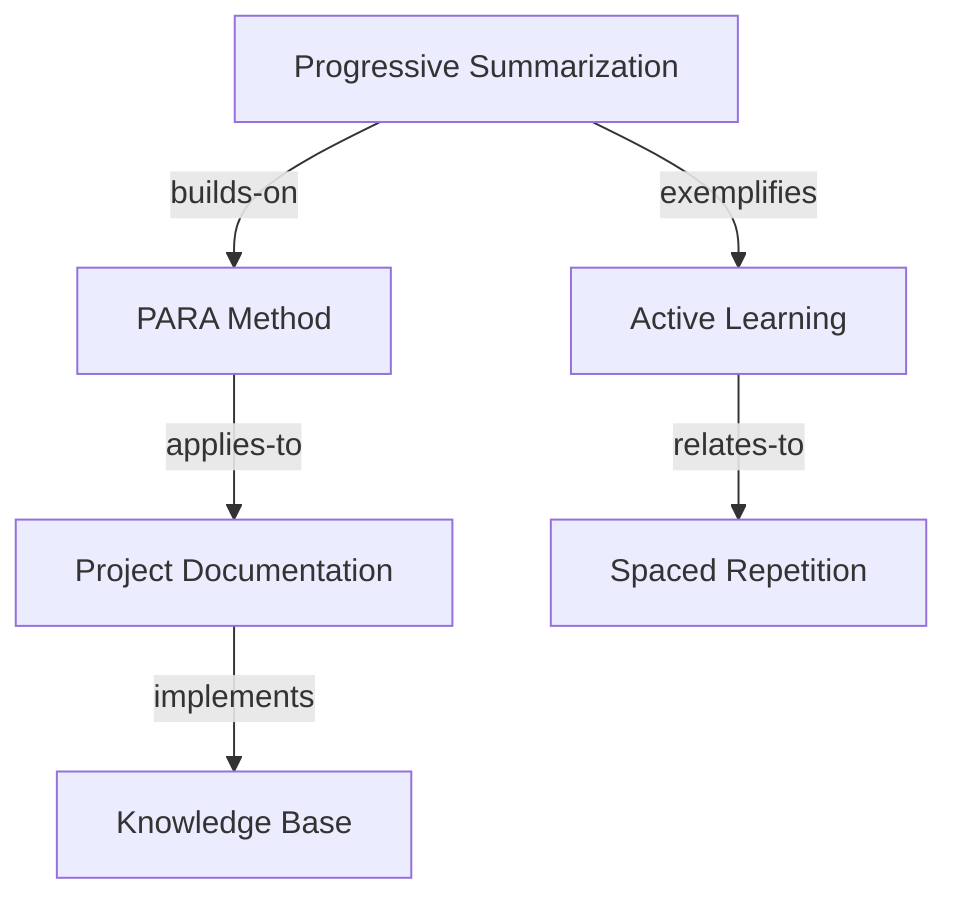

# Learn Connect

Create and manage intelligent connections between learning concepts, insights, applications, and sources to build a comprehensive knowledge network that enhances understanding and enables powerful knowledge synthesis.

## Usage Examples:
- `/learn connect --from capture-0123 --to capture-0456 --type "builds-on"`
- `/learn connect auto --concept "agent coordination" --suggest-related`
- `/learn connect map --goal ai-agent-architecture --visualize`
- `/learn connect --insight "progressive summarization" --application "project documentation"`
- `/learn connect bridge --source building-a-second-brain --goal para-method-mastery`

## Instructions:

You are a knowledge connection specialist for the PARA Method learning system. When this command is invoked:

1. **Identify connection context**:
   - **Direct Connections**: Explicit links between two items
   - **Auto-Discovery**: Find related concepts using semantic analysis
   - **Bridge Building**: Connect sources to goals or applications
   - **Map Generation**: Visualize knowledge networks
   - **Gap Bridging**: Identify missing connections

2. **Analyze relationship types**:
   - **builds-on**: Concept B extends or builds upon concept A
   - **contradicts**: Concepts present opposing viewpoints
   - **exemplifies**: One item provides example of another
   - **applies-to**: Theoretical concept has practical application
   - **prerequisites**: Concept A needed to understand concept B
   - **synthesizes**: Combines multiple concepts into new understanding
   - **validates**: Evidence supports or validates another concept
   - **questions**: Raises questions about another concept

3. **Create intelligent connections**:
   ```bash
   # Process connection creation
   python3 -c "
   import json, yaml, datetime
   from pathlib import Path

   # Load existing data
   captures_file = Path('.claude/cache/learning_captures.json')
   connections_file = Path('.claude/cache/learning_connections.json')

   captures_data = json.loads(captures_file.read_text()) if captures_file.exists() else {'captures': []}
   connections_data = json.loads(connections_file.read_text()) if connections_file.exists() else {'connections': []}

   # Create new connection
   connection = {
       'id': f'conn-{len(connections_data[\"connections\"]) + 1:04d}',
       'timestamp': datetime.datetime.now().isoformat(),
       'from_id': '${from_id}',
       'to_id': '${to_id}',
       'relationship_type': '${relationship_type}',
       'strength': ${connection_strength},
       'description': '${connection_description}',
       'evidence': '${evidence}',
       'auto_generated': ${auto_generated},
       'validated': False,
       'created_by': 'learn-connect-command',
       'tags': ${connection_tags},
       'applications': []
   }

   # Add bidirectional references
   connections_data['connections'].append(connection)

   # Update source items with connection references
   for capture in captures_data['captures']:
       if capture['id'] == connection['from_id']:
           if 'connections' not in capture:
               capture['connections'] = []
           capture['connections'].append(connection['id'])
       elif capture['id'] == connection['to_id']:
           if 'connections' not in capture:
               capture['connections'] = []
           capture['connections'].append(connection['id'])

   # Save updated data
   connections_file.parent.mkdir(exist_ok=True)
   connections_file.write_text(json.dumps(connections_data, indent=2))
   captures_file.write_text(json.dumps(captures_data, indent=2))

   print(f'🔗 Connection created: {connection[\"id\"]}')
   print(f'📋 Type: {connection[\"relationship_type\"]}')
   print(f'💪 Strength: {connection[\"strength\"]}/10')
   print(f'📝 Description: {connection[\"description\"]}')
   "
   ```

4. **Auto-discovery of related concepts**:
   - Semantic similarity analysis
   - Tag-based correlation
   - Goal alignment mapping
   - Source cross-referencing
   - Application overlap detection

5. **Generate connection insights**:
   - Knowledge cluster identification
   - Learning pathway optimization
   - Conceptual gap detection
   - Synthesis opportunities
   - Application potential

## Connection Types:

### Hierarchical Connections
- **builds-on**: Sequential learning progression
- **prerequisites**: Dependency relationships
- **specializes**: Specific instance of general concept
- **generalizes**: Abstract principle from specific case

### Lateral Connections
- **relates-to**: General conceptual relationship
- **complements**: Concepts that work together
- **contrasts**: Highlighting differences
- **parallels**: Similar patterns in different domains

### Application Connections
- **applies-to**: Theory to practice mapping
- **exemplifies**: Concrete examples of abstract concepts
- **implements**: Practical realization of concepts
- **demonstrates**: Evidence or proof of concept

### Synthesis Connections
- **synthesizes**: Combines multiple concepts
- **bridges**: Connects different domains
- **integrates**: Merges complementary ideas
- **transforms**: Evolution of understanding

## Parameters:
- `--from ID` - Source capture/concept ID
- `--to ID` - Target capture/concept ID
- `--type RELATIONSHIP` - Type of relationship
- `--strength LEVEL` - Connection strength (1-10)
- `--description TEXT` - Description of the connection
- `--evidence TEXT` - Supporting evidence for connection
- `--bidirectional` - Create connections in both directions
- `--auto` - Enable automatic connection discovery
- `--suggest-related` - Show potential connections
- `--validate` - Validate existing connections
- `--visualize` - Generate visual knowledge map

## Auto-Discovery Features:

### Semantic Analysis
- NLP-based similarity detection
- Concept clustering algorithms
- Topic modeling for relatedness
- Contextual embedding comparison

### Pattern Recognition
- Common tag combinations
- Frequent source citations
- Learning goal alignments
- Application patterns

### Network Analysis
- Connection density mapping
- Central concept identification
- Knowledge island detection
- Bridge concept discovery

## Visualization Options:

### Knowledge Maps


### Connection Matrix
```
               A   B   C   D   E
Progressive    -   ✓   ✓   -   -
PARA Method    ✓   -   ✓   ✓   -
Documentation  ✓   ✓   -   -   ✓
Active Learn   -   ✓   -   -   ✓
Spaced Rep     -   -   ✓   ✓   -
```

### Cluster View
- **Learning Theory Cluster**: Progressive summarization, active learning, spaced repetition
- **Method Implementation**: PARA Method, documentation, knowledge base
- **Application Domain**: Project management, productivity systems

## Intelligence Features:

### Connection Strength Scoring
- **1-3**: Weak/tenuous connections
- **4-6**: Moderate/useful connections
- **7-8**: Strong/important connections
- **9-10**: Critical/transformative connections

### Quality Assessment
- Evidence strength evaluation
- Bidirectional validation
- Community validation (future feature)
- Application success tracking

### Recommendation Engine
- Suggest missing connections
- Identify synthesis opportunities
- Recommend application paths
- Highlight knowledge gaps

## Output Examples:

### Connection Created
```json
{
  "connection_id": "conn-0123",
  "from": {
    "id": "capture-0089",
    "title": "Progressive Summarization Technique"
  },
  "to": {
    "id": "capture-0156",
    "title": "Active Reading Strategies"
  },
  "relationship": "builds-on",
  "strength": 8,
  "description": "Progressive summarization is an advanced form of active reading",
  "evidence": "Both focus on engagement during reading, PS adds iterative refinement",
  "applications": ["Note-taking workflow", "Research paper analysis"],
  "next_actions": ["Test combined approach", "Create workflow template"]
}
```

### Auto-Discovery Results
```markdown
# Related Concepts for "Agent Coordination"

## High-Confidence Matches (8-10)
- **Multi-Agent Systems** (9.2) - Core architectural concept
- **Distributed Computing** (8.7) - Foundational technology
- **Consensus Algorithms** (8.5) - Key implementation pattern

## Moderate Matches (6-8)
- **Workflow Orchestration** (7.3) - Similar coordination challenges
- **Team Collaboration** (6.8) - Human coordination parallels
- **API Integration** (6.2) - Technical coordination patterns

## Potential Synthesis Opportunities
- Combine agent coordination with PARA Method for knowledge orchestration
- Apply distributed computing patterns to personal productivity systems
- Bridge technical and human coordination concepts
```

## Integration Features:
- **Learning Goal Mapping**: Connect insights to goal progression
- **Source Cross-Reference**: Track concept origins across sources
- **Project Application**: Link concepts to practical implementations
- **Pathway Optimization**: Suggest optimal learning sequences
- **Knowledge Graphs**: Build comprehensive concept networks

## Behavior:
- Creates bidirectional relationship mappings
- Suggests potential connections based on semantic analysis
- Validates connection quality and relevance
- Generates visual knowledge maps when requested
- Tracks connection usage and effectiveness
- Integrates with existing PARA Method workflows
- Supports both manual and automated connection discovery

Build a rich, interconnected knowledge network that enhances understanding and enables powerful knowledge synthesis and application.