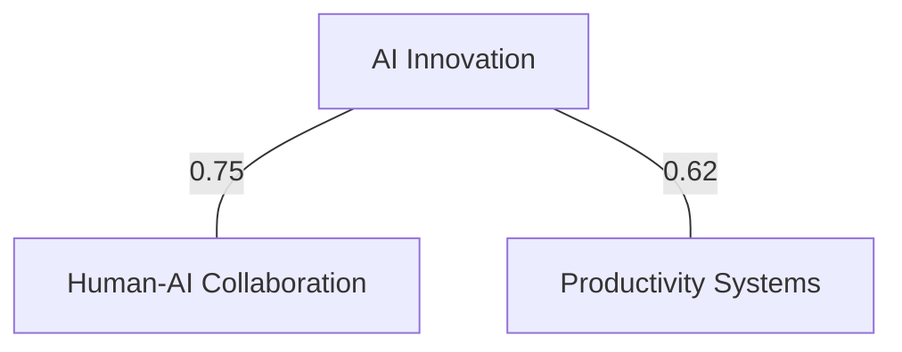

# Learn Map

Generate interactive knowledge graphs and visual maps of learning connections with advanced relationship analysis, concept clustering, and learning journey visualization for comprehensive knowledge exploration.

## Usage Examples:
- `/learn map --type concept-graph --focus ai-innovation --depth 3`
- `/learn map --journey --timeframe 90d --show-evolution`
- `/learn map --connections --min-strength 0.6 --format mermaid`
- `/learn map --export-cytoscape --include-metadata --goal productivity-systems`

## Instructions:

You are a knowledge graph specialist for the PARA Method learning system. When this command is invoked:

1. **Parse knowledge mapping request**:
   - Graph type and visualization preferences
   - Focus areas, depth levels, and filtering criteria
   - Connection strength thresholds and relationship types
   - Export format and interactive feature requirements
   - Timeframe and evolution tracking preferences

2. **Analyze knowledge structure**:
   - Extract concepts, relationships, and connection strengths
   - Identify concept clusters and knowledge domains
   - Map learning sources to concept networks
   - Calculate relationship weights and influence scores
   - Detect knowledge bridges and central concepts

3. **Generate knowledge representations**:
   - **Concept Graphs**: Network of concepts with relationship strengths
   - **Learning Journeys**: Temporal evolution of knowledge development
   - **Domain Maps**: Clustered visualization of knowledge areas
   - **Influence Networks**: Central concepts and their impact radius
   - **Connection Bridges**: Key concepts linking different domains
   - **Goal Alignment Maps**: Learning progress toward objectives

4. **Create interactive knowledge map**:
   ```bash
   python3 -c "
   import json, yaml, datetime, re
   from pathlib import Path
   from collections import defaultdict, Counter
   import math
   from itertools import combinations

   # Load learning data
   captures_file = Path('.claude/cache/learning_captures.json')
   sources_file = Path('.claude/sources.yaml')
   goals_file = Path('.claude/learning_goals.yaml')

   captures_data = json.loads(captures_file.read_text()) if captures_file.exists() else {'captures': []}
   sources_data = yaml.safe_load(sources_file.read_text()) if sources_file.exists() else {'sources': {}}
   goals_data = yaml.safe_load(goals_file.read_text()) if goals_file.exists() else {'learning_goals': {}}

   # Parse parameters
   map_type = '${type}' or 'concept-graph'
   focus_area = '${focus}' or None
   depth = int('${depth}') if '${depth}' else 2
   min_strength = float('${min_strength}') if '${min_strength}' else 0.3
   timeframe_days = int('${timeframe}'.replace('d', '')) if '${timeframe}' else None
   export_format = '${format}' or 'json'
   show_evolution = bool('${show_evolution}')

   # Filter captures by timeframe if specified
   captures = captures_data.get('captures', [])
   if timeframe_days:
       cutoff_date = datetime.datetime.now() - datetime.timedelta(days=timeframe_days)
       captures = [
           c for c in captures
           if datetime.datetime.fromisoformat(c.get('timestamp', '')) >= cutoff_date
       ]

   # Advanced Knowledge Graph Generation Engine
   class KnowledgeGraphGenerator:
       def __init__(self, captures, sources, goals):
           self.captures = captures
           self.sources = sources
           self.goals = goals
           self.concepts = {}
           self.relationships = []
           self.clusters = {}
           self.temporal_evolution = []

       def extract_concepts(self):
           '''Extract and normalize concepts from all learning captures'''
           concept_frequency = Counter()
           concept_sources = defaultdict(list)
           concept_timestamps = defaultdict(list)

           for capture in self.captures:
               capture_concepts = []

               # Extract concepts from different content types
               content = capture.get('content', {})
               if content.get('key_concepts'):
                   capture_concepts.extend(content['key_concepts'])
               if content.get('concepts'):
                   capture_concepts.extend(content['concepts'])
               if content.get('insights'):
                   # Extract conceptual terms from insights
                   insights_text = ' '.join(content['insights'])
                   concept_matches = re.findall(r'\\b[A-Z][a-z]+(?:\\s+[A-Z][a-z]+)*\\b|\\b[a-z]+-[a-z]+\\b', insights_text)
                   capture_concepts.extend(concept_matches[:3])

               # Normalize concepts (lowercase, standardize)
               normalized_concepts = []
               for concept in capture_concepts:
                   normalized = re.sub(r'[^a-zA-Z0-9\\s-]', '', concept.lower().strip())
                   if len(normalized) > 2:
                       normalized_concepts.append(normalized)

               # Track concept metadata
               timestamp = capture.get('timestamp', '')
               source_type = capture.get('source_type', 'unknown')

               for concept in normalized_concepts:
                   concept_frequency[concept] += 1
                   concept_sources[concept].append({
                       'capture_id': capture.get('id'),
                       'source_type': source_type,
                       'timestamp': timestamp
                   })
                   if timestamp:
                       concept_timestamps[concept].append(timestamp)

           # Create concept nodes with metadata
           for concept, frequency in concept_frequency.items():
               if frequency >= 2:  # Only include concepts mentioned multiple times
                   sources_list = concept_sources[concept]
                   timestamps_list = concept_timestamps[concept]

                   # Calculate concept importance score
                   source_diversity = len(set(s['source_type'] for s in sources_list))
                   recency_score = self._calculate_recency_score(timestamps_list)
                   importance = (frequency * 0.4) + (source_diversity * 0.3) + (recency_score * 0.3)

                   self.concepts[concept] = {
                       'id': concept,
                       'label': concept.replace('-', ' ').title(),
                       'frequency': frequency,
                       'importance': importance,
                       'source_diversity': source_diversity,
                       'sources': sources_list,
                       'timestamps': timestamps_list,
                       'first_seen': min(timestamps_list) if timestamps_list else None,
                       'last_seen': max(timestamps_list) if timestamps_list else None
                   }

       def _calculate_recency_score(self, timestamps):
           '''Calculate recency score based on timestamp distribution'''
           if not timestamps:
               return 0

           now = datetime.datetime.now()
           scores = []

           for ts in timestamps:
               try:
                   dt = datetime.datetime.fromisoformat(ts)
                   days_ago = (now - dt).days
                   # Exponential decay: more recent = higher score
                   score = math.exp(-days_ago / 30.0)  # 30-day half-life
                   scores.append(score)
               except:
                   continue

           return sum(scores) / len(scores) if scores else 0

       def calculate_relationships(self):
           '''Calculate relationships between concepts based on co-occurrence'''
           concept_pairs = defaultdict(list)

           # Find co-occurring concepts within same captures
           for capture in self.captures:
               capture_concepts = []
               content = capture.get('content', {})

               if content.get('key_concepts'):
                   capture_concepts.extend(content['key_concepts'])
               if content.get('concepts'):
                   capture_concepts.extend(content['concepts'])

               # Normalize concepts
               normalized_concepts = []
               for concept in capture_concepts:
                   normalized = re.sub(r'[^a-zA-Z0-9\\s-]', '', concept.lower().strip())
                   if normalized in self.concepts:
                       normalized_concepts.append(normalized)

               # Create pairs from co-occurring concepts
               for concept1, concept2 in combinations(normalized_concepts, 2):
                   if concept1 != concept2:
                       pair_key = tuple(sorted([concept1, concept2]))
                       concept_pairs[pair_key].append({
                           'capture_id': capture.get('id'),
                           'source_type': capture.get('source_type'),
                           'timestamp': capture.get('timestamp')
                       })

           # Create relationship edges with strength calculation
           for (concept1, concept2), occurrences in concept_pairs.items():
               if len(occurrences) >= 1:  # At least one co-occurrence
                   # Calculate relationship strength
                   co_occurrence_count = len(occurrences)
                   concept1_freq = self.concepts[concept1]['frequency']
                   concept2_freq = self.concepts[concept2]['frequency']

                   # Jaccard-like coefficient with frequency weighting
                   strength = co_occurrence_count / (concept1_freq + concept2_freq - co_occurrence_count)

                   # Boost strength for diverse source types
                   source_types = set(occ['source_type'] for occ in occurrences)
                   diversity_boost = len(source_types) * 0.1
                   strength = min(strength + diversity_boost, 1.0)

                   if strength >= min_strength:
                       self.relationships.append({
                           'source': concept1,
                           'target': concept2,
                           'weight': strength,
                           'co_occurrences': co_occurrence_count,
                           'source_types': list(source_types),
                           'first_connection': min(occ['timestamp'] for occ in occurrences if occ['timestamp']),
                           'last_connection': max(occ['timestamp'] for occ in occurrences if occ['timestamp'])
                       })

       def generate_clusters(self):
           '''Generate concept clusters using relationship strength'''
           # Simple clustering based on strong connections
           visited = set()
           cluster_id = 0

           for concept in self.concepts:
               if concept not in visited:
                   cluster = self._explore_cluster(concept, visited)
                   if len(cluster) >= 2:  # Only meaningful clusters
                       self.clusters[f'cluster_{cluster_id}'] = {
                           'id': f'cluster_{cluster_id}',
                           'concepts': cluster,
                           'size': len(cluster),
                           'avg_importance': sum(self.concepts[c]['importance'] for c in cluster) / len(cluster),
                           'domain_label': self._generate_cluster_label(cluster)
                       }
                       cluster_id += 1

       def _explore_cluster(self, start_concept, visited, min_cluster_strength=0.5):
           '''Explore connected concepts to form cluster'''
           cluster = [start_concept]
           visited.add(start_concept)
           stack = [start_concept]

           while stack:
               current = stack.pop()

               # Find strongly connected concepts
               for relationship in self.relationships:
                   if relationship['weight'] >= min_cluster_strength:
                       connected_concept = None
                       if relationship['source'] == current and relationship['target'] not in visited:
                           connected_concept = relationship['target']
                       elif relationship['target'] == current and relationship['source'] not in visited:
                           connected_concept = relationship['source']

                       if connected_concept:
                           cluster.append(connected_concept)
                           visited.add(connected_concept)
                           stack.append(connected_concept)

           return cluster

       def _generate_cluster_label(self, concepts):
           '''Generate meaningful label for concept cluster'''
           # Use most important concept or find common theme
           concept_labels = [self.concepts[c]['label'] for c in concepts]

           # Find common words
           all_words = []
           for label in concept_labels:
               all_words.extend(label.lower().split())

           word_counts = Counter(all_words)
           common_words = [word for word, count in word_counts.items() if count > 1 and len(word) > 3]

           if common_words:
               return common_words[0].title() + ' Domain'
           else:
               # Use most important concept
               most_important = max(concepts, key=lambda c: self.concepts[c]['importance'])
               return self.concepts[most_important]['label'] + ' Domain'

       def generate_temporal_evolution(self):
           '''Generate temporal evolution of concept development'''
           if not show_evolution:
               return

           # Group concepts by time periods (weekly)
           time_periods = defaultdict(list)

           for concept, data in self.concepts.items():
               for timestamp in data['timestamps']:
                   try:
                       dt = datetime.datetime.fromisoformat(timestamp)
                       week_key = dt.strftime('%Y-W%U')
                       time_periods[week_key].append(concept)
                   except:
                       continue

           # Create evolution timeline
           sorted_periods = sorted(time_periods.keys())
           cumulative_concepts = set()

           for period in sorted_periods:
               new_concepts = [c for c in time_periods[period] if c not in cumulative_concepts]
               cumulative_concepts.update(new_concepts)

               if new_concepts:
                   self.temporal_evolution.append({
                       'period': period,
                       'new_concepts': new_concepts,
                       'total_concepts': len(cumulative_concepts),
                       'growth_rate': len(new_concepts) / max(len(cumulative_concepts) - len(new_concepts), 1)
                   })

   # Generate knowledge graph
   generator = KnowledgeGraphGenerator(captures, sources_data, goals_data)
   generator.extract_concepts()
   generator.calculate_relationships()
   generator.generate_clusters()
   generator.generate_temporal_evolution()

   # Focus filtering if specified
   if focus_area:
       focus_concepts = {
           concept for concept, data in generator.concepts.items()
           if focus_area.lower() in data['label'].lower()
       }

       if focus_concepts:
           # Include concepts within specified depth
           expanded_concepts = set(focus_concepts)

           for _ in range(depth):
               new_concepts = set()
               for relationship in generator.relationships:
                   if relationship['source'] in expanded_concepts:
                       new_concepts.add(relationship['target'])
                   elif relationship['target'] in expanded_concepts:
                       new_concepts.add(relationship['source'])
               expanded_concepts.update(new_concepts)

           # Filter concepts and relationships
           generator.concepts = {k: v for k, v in generator.concepts.items() if k in expanded_concepts}
           generator.relationships = [
               r for r in generator.relationships
               if r['source'] in expanded_concepts and r['target'] in expanded_concepts
           ]

   # Create knowledge map output
   knowledge_map = {
       'id': f'knowledge-map-{datetime.datetime.now().strftime(\"%Y%m%d-%H%M%S\")}',
       'timestamp': datetime.datetime.now().isoformat(),
       'type': map_type,
       'parameters': {
           'focus_area': focus_area,
           'depth': depth,
           'min_strength': min_strength,
           'timeframe_days': timeframe_days,
           'show_evolution': show_evolution
       },
       'graph_data': {
           'nodes': list(generator.concepts.values()),
           'edges': generator.relationships,
           'clusters': generator.clusters,
           'temporal_evolution': generator.temporal_evolution
       },
       'statistics': {
           'total_concepts': len(generator.concepts),
           'total_relationships': len(generator.relationships),
           'total_clusters': len(generator.clusters),
           'avg_relationship_strength': sum(r['weight'] for r in generator.relationships) / max(len(generator.relationships), 1),
           'most_connected_concept': max(generator.concepts.values(), key=lambda c: c['importance'])['label'] if generator.concepts else None,
           'strongest_connection': max(generator.relationships, key=lambda r: r['weight']) if generator.relationships else None
       }
   }

   # Generate export formats
   exports = {}

   if export_format == 'mermaid' or export_format == 'all':
       # Generate Mermaid graph syntax
       mermaid_lines = ['graph TD']

       # Add nodes with styling
       for concept_id, concept_data in generator.concepts.items():
           importance = concept_data['importance']
           if importance > 5:
               style_class = 'high-importance'
           elif importance > 2:
               style_class = 'medium-importance'
           else:
               style_class = 'low-importance'

           mermaid_lines.append(f'    {concept_id}[\"{concept_data[\"label\"]}\"::::{style_class}]')

       # Add edges
       for relationship in generator.relationships:
           weight = relationship['weight']
           line_style = 'thick' if weight > 0.7 else 'thin'
           mermaid_lines.append(f'    {relationship[\"source\"]} ---|{weight:.2f}| {relationship[\"target\"]}')

       # Add styling
       mermaid_lines.extend([
           'classDef high-importance fill:#1f4e8c,stroke:#fff,stroke-width:2px,color:#fff',
           'classDef medium-importance fill:#2a2f45,stroke:#1f4e8c,stroke-width:2px,color:#e0e6f0',
           'classDef low-importance fill:#333a56,stroke:#a3a9bf,stroke-width:1px,color:#e0e6f0'
       ])

       exports['mermaid'] = '\\n'.join(mermaid_lines)

   if export_format == 'cytoscape' or export_format == 'all':
       # Generate Cytoscape.js format
       cytoscape_elements = []

       # Add nodes
       for concept_id, concept_data in generator.concepts.items():
           cytoscape_elements.append({
               'data': {
                   'id': concept_id,
                   'label': concept_data['label'],
                   'importance': concept_data['importance'],
                   'frequency': concept_data['frequency']
               }
           })

       # Add edges
       for i, relationship in enumerate(generator.relationships):
           cytoscape_elements.append({
               'data': {
                   'id': f'edge_{i}',
                   'source': relationship['source'],
                   'target': relationship['target'],
                   'weight': relationship['weight']
               }
           })

       exports['cytoscape'] = {'elements': cytoscape_elements}

   knowledge_map['exports'] = exports

   # Save knowledge map
   maps_file = Path('.claude/cache/knowledge_maps.json')
   if maps_file.exists():
       maps_data = json.loads(maps_file.read_text())
   else:
       maps_data = {'maps': []}

   maps_data['maps'].append(knowledge_map)

   # Keep only last 5 maps
   maps_data['maps'] = maps_data['maps'][-5:]

   maps_file.parent.mkdir(exist_ok=True)
   maps_file.write_text(json.dumps(maps_data, indent=2))

   # Generate response
   response = {
       'status': 'success',
       'command': '/learn map',
       'data': {
           'map_id': knowledge_map['id'],
           'map_type': map_type,
           'graph_summary': {
               'concepts': knowledge_map['statistics']['total_concepts'],
               'relationships': knowledge_map['statistics']['total_relationships'],
               'clusters': knowledge_map['statistics']['total_clusters'],
               'avg_connection_strength': round(knowledge_map['statistics']['avg_relationship_strength'], 3)
           },
           'key_insights': {
               'central_concept': knowledge_map['statistics']['most_connected_concept'],
               'strongest_connection': knowledge_map['statistics']['strongest_connection']['source'] + ' ↔ ' + knowledge_map['statistics']['strongest_connection']['target'] if knowledge_map['statistics']['strongest_connection'] else None,
               'knowledge_density': len(generator.relationships) / max(len(generator.concepts), 1)
           },
           'visualization': {
               'focus_area': focus_area,
               'depth_explored': depth,
               'connection_threshold': min_strength,
               'available_formats': list(exports.keys()) if exports else ['json']
           }
       },
       'graph_highlights': {
           'most_important_concepts': sorted(
               [(c['label'], c['importance']) for c in generator.concepts.values()],
               key=lambda x: x[1], reverse=True
           )[:5],
           'strongest_connections': sorted(
               [(r['source'], r['target'], r['weight']) for r in generator.relationships],
               key=lambda x: x[2], reverse=True
           )[:3],
           'largest_clusters': sorted(
               [(c['domain_label'], c['size']) for c in generator.clusters.values()],
               key=lambda x: x[1], reverse=True
           )[:3]
       },
       'exploration_suggestions': [
           f'Explore the {knowledge_map[\"statistics\"][\"most_connected_concept\"]} concept network in detail',
           f'Investigate connections between top clusters for synthesis opportunities',
           f'Deep dive into concepts with high importance but few connections'
       ]
   }

   # Add temporal evolution if requested
   if show_evolution and generator.temporal_evolution:
       response['temporal_analysis'] = {
           'evolution_periods': len(generator.temporal_evolution),
           'growth_trend': 'increasing' if generator.temporal_evolution[-1]['growth_rate'] > generator.temporal_evolution[0]['growth_rate'] else 'stabilizing',
           'recent_concepts': generator.temporal_evolution[-1]['new_concepts'] if generator.temporal_evolution else []
       }

   print(json.dumps(response, indent=2))
   "
   ```

5. **Provide interactive knowledge exploration**:
   - Advanced graph generation with relationship strength calculation
   - Concept clustering with domain identification
   - Temporal evolution tracking and growth analysis
   - Export capabilities for external visualization tools
   - Interactive filtering and focus area exploration

## Knowledge Map Types:

### Concept Graph
- **Network Visualization**: Concepts as nodes, relationships as edges
- **Strength Weighting**: Connection thickness based on relationship strength
- **Importance Scaling**: Node size based on concept importance score

### Learning Journey
- **Temporal Flow**: Chronological development of knowledge
- **Evolution Tracking**: How concepts and connections develop over time
- **Growth Analysis**: Learning velocity and knowledge expansion patterns

### Domain Clustering
- **Knowledge Domains**: Grouped concepts by thematic similarity
- **Cluster Analysis**: Domain size, coherence, and interconnectedness
- **Bridge Concepts**: Key concepts connecting different domains

## Parameters:
- `--type TYPE` - Map type (concept-graph, journey, clusters, influence)
- `--focus AREA` - Focus on specific concept or domain
- `--depth N` - Exploration depth from focus area (1-5)
- `--min-strength FLOAT` - Minimum connection strength (0.0-1.0)
- `--timeframe PERIOD` - Time period for analysis (30d, 90d, 1y)
- `--show-evolution` - Include temporal evolution analysis
- `--format FORMAT` - Export format (mermaid, cytoscape, d3, json)
- `--export-cytoscape` - Generate Cytoscape.js compatible format
- `--include-metadata` - Include detailed concept metadata
- `--goal GOAL_ID` - Align map with specific learning goal
- `--interactive` - Generate interactive exploration features

## Natural Language Processing:
Automatically detects:
- Graph requests: "map knowledge", "visualize connections", "knowledge graph"
- Journey tracking: "learning journey", "evolution", "progress over time"
- Relationship analysis: "connections", "relationships", "how concepts relate"
- Domain exploration: "clusters", "domains", "knowledge areas"
- Export needs: "export", "visualize", "mermaid", "graph format"

## Visualization Features:

### Interactive Graph Elements
```markdown
🎯 **Node Properties**:
- Size: Based on concept importance and frequency
- Color: Domain clustering or temporal emergence
- Position: Force-directed layout with relationship strength
- Metadata: Hover details with sources, timestamps, connections

🔗 **Edge Properties**:
- Thickness: Relationship strength visualization
- Color: Connection type (conceptual, temporal, source-based)
- Animation: Recent connections highlighted
- Labels: Connection strength values and context
```

### Export Formats
```markdown
📊 **Mermaid Diagram**:


🌐 **Cytoscape.js**: Interactive web-based visualization
📈 **D3.js**: Custom interactive graph visualizations
📋 **JSON**: Raw data for custom visualization tools
```

### Advanced Analytics
```markdown
📊 **Graph Metrics**:
- Network Density: Connection richness across knowledge base
- Centrality Scores: Most influential concepts in network
- Clustering Coefficient: How well concepts group together
- Path Lengths: Degrees of separation between concepts

🔍 **Exploration Features**:
- Focus Mode: Zoom into specific concept neighborhoods
- Layer Filtering: Show/hide connection types and strengths
- Temporal Slider: Replay knowledge evolution over time
- Search Integration: Find concepts and trace connections
```

## Output Examples:

### Concept Graph Visualization
```json
{
  "status": "success",
  "command": "/learn map",
  "data": {
    "map_id": "knowledge-map-20241214-152030",
    "map_type": "concept-graph",
    "graph_summary": {
      "concepts": 28,
      "relationships": 45,
      "clusters": 6,
      "avg_connection_strength": 0.542
    },
    "key_insights": {
      "central_concept": "AI Innovation",
      "strongest_connection": "human-ai collaboration ↔ productivity systems",
      "knowledge_density": 1.61
    },
    "visualization": {
      "focus_area": "ai-innovation",
      "depth_explored": 3,
      "connection_threshold": 0.3,
      "available_formats": ["mermaid", "cytoscape"]
    }
  },
  "graph_highlights": {
    "most_important_concepts": [
      ["AI Innovation", 8.4],
      ["Human-AI Collaboration", 6.7],
      ["Productivity Systems", 5.9]
    ],
    "strongest_connections": [
      ["ai-innovation", "human-ai-collaboration", 0.85],
      ["productivity-systems", "workflow-automation", 0.78],
      ["leadership-development", "team-collaboration", 0.72]
    ],
    "largest_clusters": [
      ["AI Innovation Domain", 8],
      ["Productivity Domain", 6],
      ["Leadership Domain", 5]
    ]
  }
}
```

### Learning Journey Evolution
```json
{
  "status": "success",
  "command": "/learn map",
  "data": {
    "map_type": "journey",
    "temporal_analysis": {
      "evolution_periods": 12,
      "growth_trend": "increasing",
      "recent_concepts": ["ai-governance", "ethical-ai", "human-centered-design"]
    },
    "journey_insights": {
      "learning_acceleration": "45% increase in concept acquisition rate",
      "domain_expansion": "Expanded from 3 to 6 knowledge domains",
      "connection_density_growth": "Network connections increased 3.2x"
    }
  }
}
```

## Integration Features:
- **Live Graph Updates**: Real-time updates as new learning is captured
- **Export Compatibility**: Support for popular graph visualization tools
- **Interactive Exploration**: Drill-down capabilities and dynamic filtering
- **Learning Goal Alignment**: Map progress toward specific objectives
- **Knowledge Bridge Detection**: Identify concepts connecting disparate domains

## Behavior:
- Creates comprehensive knowledge graphs with relationship strength analysis
- Provides interactive visualization with multiple export format options
- Identifies key concepts, clusters, and connection patterns
- Generates temporal evolution tracking for learning journey analysis
- Maintains graph history with version comparison capabilities
- Supports both automated graph generation and focused exploration workflows
- Integrates with existing PARA Method learning infrastructure

Transform your accumulated knowledge into visual intelligence with interactive graphs, relationship analysis, and comprehensive knowledge exploration capabilities.